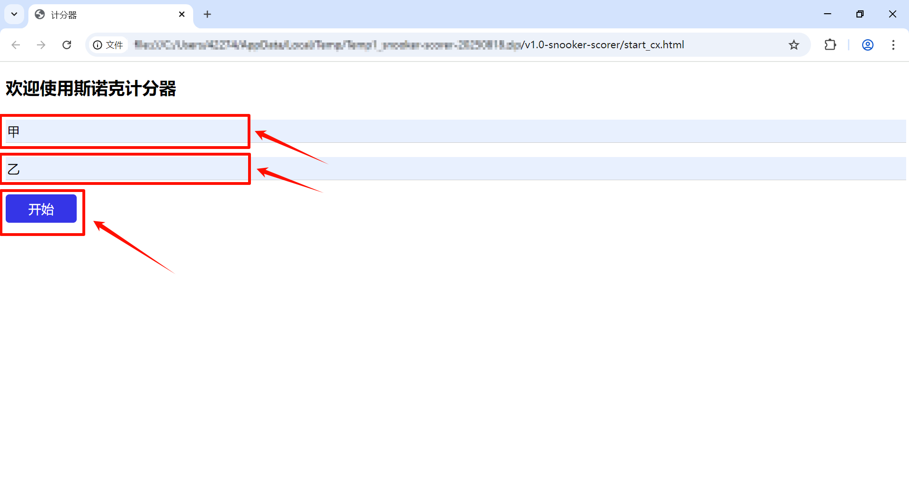

# 斯诺克计分器

快速跳转：[快速启动](https://github.com/ChenTianyi2025/snooker-scorer/blob/main/README.md#%E5%BF%AB%E9%80%9F%E5%90%AF%E5%8A%A8)  [使用说明](https://github.com/ChenTianyi2025/snooker-scorer/blob/main/README.md#%E4%BD%BF%E7%94%A8%E8%AF%B4%E6%98%8E)  [计分规则](rules.md)

## 介绍
简易斯诺克比赛计分器。

程序存在不足之处，**欢迎您为本程序提出意见，帮助修改完善程序！**
> 本程序制作过程中运用了AI工具辅助

## 软件架构
1. 通过简易的**键盘操作**实现计分；
2. 用LocalStorage存储固定信息；
3. 程序通过加减乘除运算自动实现台面剩余分数计算（Remaining）。

## 快速启动

1. 从[**发行版**（Releases） ](https://github.com/ChenTianyi2025/snooker-scorer/releases)下载最新程序压缩包；

2. 解压后打开文件夹，直接双击运行`start_cx.html`即可进入程序。

## 使用说明

- 输入双方选手名字后可进入主计分界面

- 在主界面中：
0. 在`更多设置选项`中，设置台面红球数量（标准球台为15个），以实现自动计分；设置`满分杆提示`，以自动显示满分杆。

1. 直接按键盘上的数字键进行 **计分** ，例：红球入袋，得1分，按“1”；粉球入袋，得6分，按“6”。
2. 按键盘上的`Alt+数字键`实现 **罚分** ，例：目标球为红球，选手击打了蓝球，罚5分，按“Alt+5”。
3. 按回车键（Enter）实现击球方转换。
4. 更多计分规则见[ **计分规则** ](rules.md)

## 程序不足
**欢迎您为本程序提出意见，帮助修改完善程序！**
1. 本程序只能使用键盘实现计分、罚分等；
2. 页面效果有待完善；
3. 计分功能、台面剩余分数计算功能均有待完善；
4. 有关存储数据、记录大比分等功能尚未落实等。

## 参与贡献
**欢迎您为本程序提出意见，帮助修改完善程序！**
